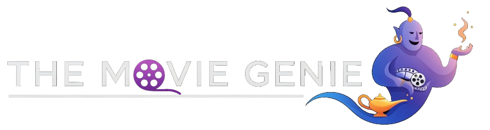

# The Movie Genie: A Full-Stack Tutorial Project 

---

## **Important: This is a Work in Progress** 

Welcome to The Movie Genie! Please be aware that this repository is an **active work in progress**. It serves as the foundation for a comprehensive, multi-hour tutorial series on building a full-stack web application from scratch.

**What this means for you:**
* **Code is Evolving:** The codebase will change frequently. Branches may be unstable, and features are being actively developed.
* **Incomplete Documentation:** You will find placeholders and `TODO` comments throughout the code and documentation.
* **Consistent Updates:** This project is being updated regularly. Check back often to see the progress and follow along with the development!

The ultimate goal is to provide a complete, step-by-step guide that is easy to follow, enabling you to build your very own version of The Movie Genie. Thank you for your patience and for joining me on this journey!

---

## About The Movie Genie

The Movie Genie is a web application designed to help you discover your next favorite movie. It randomly generates movie recommendations based on your preferences, utilizing a modern tech stack and integrating with a third-party movie database API.

This project is more than just an application; it's a living tutorial. Every line of code, every component, and every feature is being built with the express purpose of teaching you the ins and outs of modern web development.

## Features (Planned & In-Development)

* **Movie Discovery:** Browse popular, top-rated, and upcoming movies.
* **Watchlist:** Save movies to a personal watchlist to track what you want to see.
* **Movie Details:** View detailed information for each movie, including ratings, summaries, and streaming options.
* **Responsive Design:** A clean, modern UI that works beautifully on desktop and mobile devices.

## Technology Stack

This project will utilize a modern, robust technology stack, which may include:

* **Frontend:** HTML, CSS, JavaScript
* **Backend:** Java, Spring Boot, Thymeleaf
* **API:** [The Movie Database (TMDB) API](https://www.themoviedb.org/documentation/api), [WatchMode API](https://api.watchmode.com/)
* **Deployment:** Docker

## The Complete Tutorial Series (Coming Soon!)

The final output of this repository will be a complete, multi-hour video and text-based tutorial series. This course will guide you through every single step of the process, from initializing the project to final deployment.

**Topics will include:**
1.  **Project Scoping & Design:** Planning our features and designing the UI/UX.
2.  **Setting up the Development Environment:** Configuring the frontend, backend, and database.
3.  **Building the Backend:** Creating the server, defining API routes, and setting up the database schema.
4.  **Implementing User Authentication:** Securely managing user accounts and sessions.
5.  **Integrating with the TMDB API:** Fetching and managing movie data.
6.  **Developing the Frontend:** Building reusable React components and creating a dynamic user interface.
7.  **State Management:** Handling application state effectively.
8.  **Styling with Tailwind CSS:** Crafting a beautiful, responsive design.
9.  **Connecting Frontend & Backend:** Making API requests and handling data.
10. **Testing & Debugging:** Ensuring our application is robust and error-free.
11. **Deployment:** Taking our application live for the world to see!

## Current Project Status

* **Phase:** Saving history via localStorage
* **Last Update:** August 21, 2025
* **Current Focus:** Implementation of consents and saving history
* **Next Steps:** Completing static html pages and CSS (policies, about, contact)

## How to Contribute

While the core project is being developed for the tutorial, feedback, suggestions, and issue reporting are highly welcome! Please feel free to open an issue to report a bug or suggest a feature.

---

Thank you for checking out The Movie Genie! Stay tuned for updates.